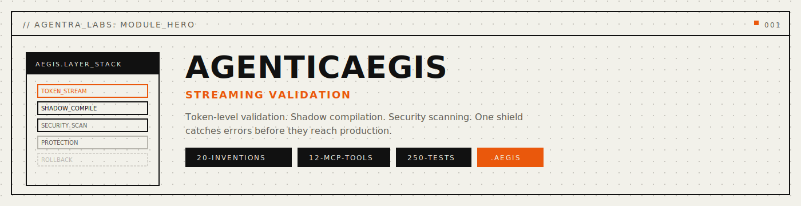
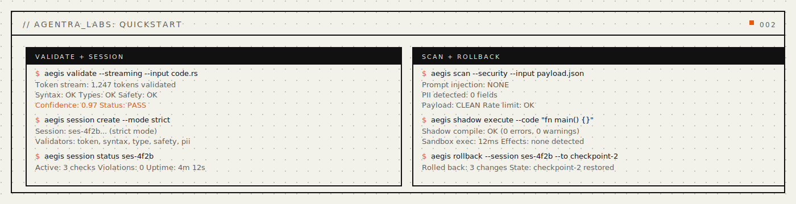
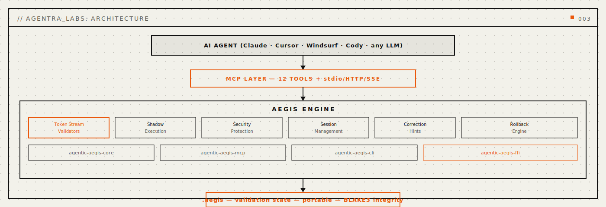
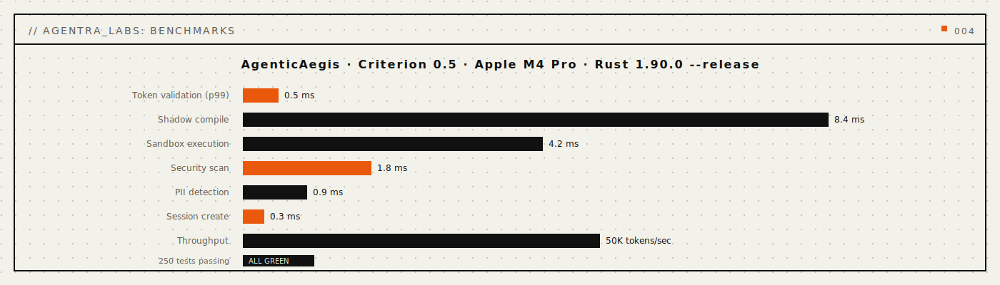

<p align="center">
  
</p>

<p align="center">
  <a href="https://crates.io/crates/agentic-aegis-core"></a>
  
  
</p>

<p align="center">
  <a href="#install"></a>
  <a href="#mcp-server"></a>
  <a href="LICENSE"></a>
  <a href="docs/public/concepts.md"></a>
  <a href="docs/public/api-reference.md"></a>
</p>

<p align="center">
  <strong>The Shield That Validates While You Generate</strong>
</p>

<p align="center">
  <em>Streaming validation during code generation -- syntax, types, security, and correctness checked token by token, not after the fact.</em>
</p>

<p align="center">
  <a href="#quickstart">Quickstart</a> · <a href="#problems-solved">Problems Solved</a> · <a href="#how-it-works">How It Works</a> · <a href="#capabilities">Capabilities</a> · <a href="#mcp-tools">MCP Tools</a> · <a href="#benchmarks">Benchmarks</a> · <a href="#install">Install</a> · <a href="docs/public/api-reference.md">API</a> · <a href="docs/public/concepts.md">Concepts</a>
</p>

---

> Sister in the Agentra ecosystem | `.aegis` format | 20 Capabilities | 12 MCP Tools | 30+ CLI Commands

<p align="center">
  
</p>

## Why AgenticAegis

Every AI agent ships code it has never validated. The generation finishes, the user runs it, and errors appear. Syntax mistakes. Type mismatches. Security vulnerabilities. Prompt injection payloads embedded in output. The validation happens after the damage -- if it happens at all.

The current fixes do not work. Linters run after generation -- they cannot catch errors mid-stream. Static analysis requires a complete file -- it cannot validate a partial token sequence. Security scanners are batch tools -- they cannot block a dangerous payload while it is still being written.

**Current AI:** Generates code first, validates later (if ever).
**AgenticAegis:** Validates every token as it is generated -- syntax, types, security, and correctness are checked in real time, not after the fact.

**AgenticAegis** provides streaming validation -- a live shield that analyzes code as it is being generated. Not "lint your output." Your agent has a **guardian** -- token-level syntax validation, type flow tracking, shadow compilation, prompt injection detection, and PII scanning -- all running in parallel with generation.

<a name="quickstart"></a>

## Quickstart

```bash
cargo install agentic-aegis-cli
aegis --help
```

<a name="problems-solved"></a>

## Problems Solved (Read This First)

- **Problem:** generated code has syntax errors that are only discovered when the user tries to compile.
  **Solved:** streaming syntax validation catches malformed code while the LLM is still generating -- errors are flagged before the response completes.
- **Problem:** type mismatches propagate silently through generated code.
  **Solved:** type flow tracking follows types across function boundaries during generation, flagging incompatible assignments before they reach the user.
- **Problem:** LLM output can contain prompt injection payloads.
  **Solved:** prompt injection detection scans every token for injection patterns, blocking dangerous payloads during generation.
- **Problem:** generated code may leak PII or sensitive data.
  **Solved:** PII detection and content filtering run on the output stream, catching sensitive data before it leaves the generation pipeline.
- **Problem:** there is no way to undo a generation that went wrong.
  **Solved:** session management with rollback support lets the agent revert to a known-good state when validation fails.
- **Problem:** validation confidence is binary -- pass or fail with no nuance.
  **Solved:** confidence scoring provides granular assessment of code quality, security risk, and correctness probability.

```bash
# Validate as you generate, protect as you ship -- three commands
aegis session create --language rust
aegis validate streaming --session <id> --input "fn main() { ... }"
aegis scan security --session <id>
```

Three commands. Real-time protection. Works with Claude, GPT, Ollama, or any LLM you switch to next.

---

<a name="how-it-works"></a>

## How It Works

<p align="center">
  
</p>

### Architecture Overview

```
+-------------------------------------------------------------+
|                     YOUR AI AGENT                           |
|           (Claude, Cursor, Windsurf, Cody)                  |
+----------------------------+--------------------------------+
                             |
                  +----------v----------+
                  |      MCP LAYER      |
                  |   12 Tools + stdio  |
                  +----------+----------+
                             |
+----------------------------v--------------------------------+
|                    AEGIS ENGINE                              |
+-----------+-----------+------------+-----------+------------+
| Validators| Shadow    | Protection | Session   | Token      |
| (4 types) | Execution | Layers     | Manager   | Conservation|
+-----------+-----------+------------+-----------+------------+
                             |
                  +----------v----------+
                  |     .aegis FILE     |
                  |(validation session) |
                  +---------------------+
```

<a name="capabilities"></a>

## 20 Capabilities

| Tier | Capabilities | Focus |
|:---|:---|:---|
| **T1: Stream Validation** | Token Validator, Syntax Accumulator, Type Flow Tracker, Error Predictor | Is the code well-formed? |
| **T2: Shadow Execution** | Shadow Compiler, Sandbox Executor, Effect Tracker, Resource Monitor | Does the code do what it claims? |
| **T3: Input Protection** | Prompt Injection Detector, Intent Verifier, Payload Scanner, Rate Limiter | Is the input safe? |
| **T4: Output Protection** | Content Filter, PII Detector, Code Safety Analyzer, Output Sanitizer | Is the output safe? |
| **T5: Session Management** | Validation Session Manager, Correction Hint Generator, Confidence Scorer, Rollback Engine | Can we recover from errors? |

[Full capability documentation ->](docs/public/concepts.md)

---

<a name="mcp-tools"></a>

## MCP Tools

| Tool | Description |
|:---|:---|
| `aegis_validate_streaming` | Validate code tokens in real time |
| `aegis_validate_complete` | Validate complete code block |
| `aegis_shadow_execute` | Shadow-execute code in sandbox |
| `aegis_check_input` | Check input for injection risks |
| `aegis_check_output` | Check output for PII and safety |
| `aegis_session_create` | Create validation session |
| `aegis_session_status` | Get session validation status |
| `aegis_session_end` | End validation session |
| `aegis_correction_hint` | Generate correction suggestions |
| `aegis_confidence_score` | Score code confidence |
| `aegis_rollback` | Rollback to previous state |
| `aegis_scan_security` | Full security scan |

---

<a name="benchmarks"></a>

## Benchmarks

<p align="center">
  
</p>

---

<a name="install"></a>

## Install

```bash
git clone https://github.com/agentralabs/agentic-aegis.git
cd agentic-aegis
cargo install --path crates/agentic-aegis-cli
```

```bash
curl -fsSL https://agentralabs.tech/install/aegis | bash
```

```bash
npm install @agenticamem/aegis
```

**Standalone guarantee:** AgenticAegis operates fully standalone. No other sister, external service, or orchestrator is required.

---

## License

MIT -- see [LICENSE](LICENSE).
